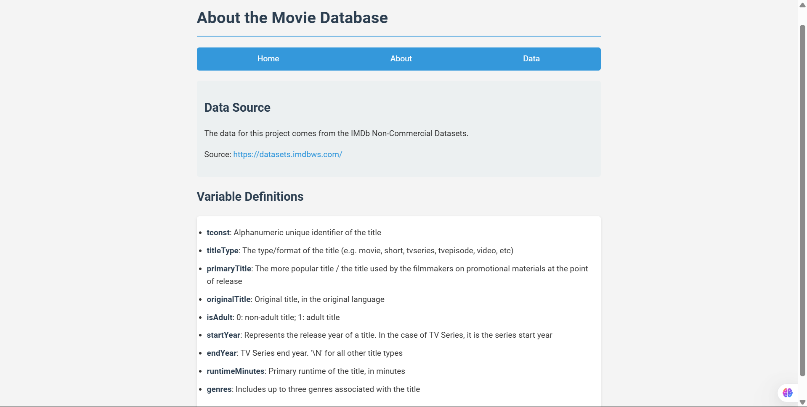
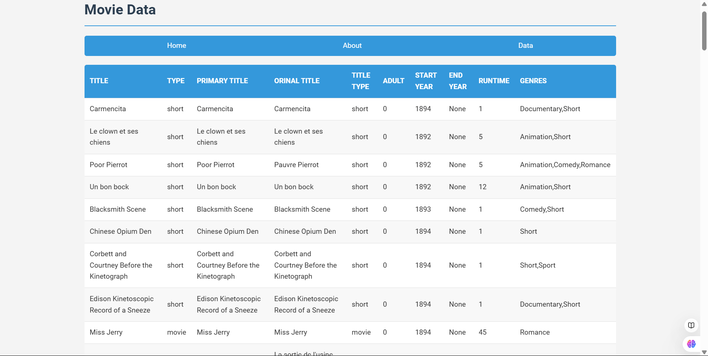

Here's a comprehensive README.md file for your Movie Database Project:


# IMDb Movie Database Project

## Project Overview
This project is a web application that provides insights into movie data using the IMDb Non-Commercial Dataset. It demonstrates data collection, database management, and web presentation using Python, SQLite, and Flask.

## Features
- Comprehensive movie database
- Web interface to explore movie data
- About page with dataset information
- Data visualization of movie statistics

## Prerequisites
- Python 3.8+
- SQLite
- Flask

## Installation

### 1. Clone the Repository
```bash
git clone https://github.com/yourusername/movie-database-project.git
cd movie-database-project
```

### 2. Create Virtual Environment
```bash
python -m venv venv
source venv/bin/activate  # On Windows, use `venv\Scripts\activate`
```

### 3. Install Dependencies
```bash
pip install -r requirements.txt
```

### 4. Prepare the Database
```bash
python database/create_db.py
```

### 5. Run the Application
```bash
python app.py
```

## Project Structure
```
movie-database-project/
│
├── database/
│   └── create_db.py         # Script to create and populate database
│
├── templates/
│   ├── index.html
│   ├── about.html
│   └── data.html
│
├── static/
│   └── css/                 # CSS stylesheets
│
├── app.py                   # Main Flask application
├── movies_database.db       # SQLite database
├── requirements.txt         # Project dependencies
└── README.md                # Project documentation
```

## Data Source
- Dataset: IMDb Non-Commercial Datasets
- Source: https://datasets.imdbws.com/
- License: Non-commercial use only

## Database Schema
| Column          | Type    | Description                                     |
|----------------|---------|------------------------------------------------|
| tconst         | TEXT    | Unique identifier for the title                 |
| titleType      | TEXT    | Type of title (movie, short, TV series, etc.)   |
| primaryTitle   | TEXT    | Popular title used for promotional materials    |
| originalTitle  | TEXT    | Original title in the original language         |
| isAdult        | INTEGER | 0: Non-adult, 1: Adult content                 |
| startYear      | INTEGER | Release year or series start year               |
| endYear        | INTEGER | Series end year (if applicable)                 |
| runtimeMinutes | INTEGER | Primary runtime in minutes                      |
| genres         | TEXT    | Up to three genres associated with the title    |

## Technologies Used
- Python
- Flask
- SQLite
- HTML/CSS

## Potential Improvements
- Add search functionality
- Implement data filtering
- Create more advanced data visualizations
- Add user authentication

## Troubleshooting
- Ensure all dependencies are installed
- Verify database file path
- Check Python and Flask versions

## Contributing
1. Fork the repository
2. Create your feature branch (`git checkout -b feature/AmazingFeature`)
3. Commit your changes (`git commit -m 'Add some AmazingFeature'`)
4. Push to the branch (`git push origin feature/AmazingFeature`)
5. Open a Pull Request

## License
This project is licensed under the MIT License - see the LICENSE.md file for details.

## Contact
Your Name - arshnoorsingh002@gmail.com
Project Link: https://github.com/Arshnoor-Singh-Sohi/MovieMatrix

## Requirements.txt
Create a `requirements.txt` file with the following content:

```
flask
sqlite3
pandas
```


## Images

### Main Page


### About Page


### Data Page

